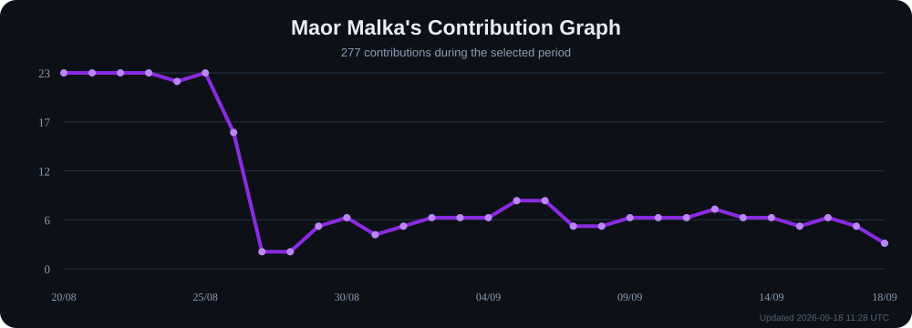

# Hi, I'm Maor Malka 👋

### Cloud • DevOps • Backend Engineering

Building infrastructure, automation pipelines and scalable systems.

 

 

---

# 📈 Contribution Graph

---

<h2 align="center">⚡ Tech Stack ⚡</h2>

### DevOps & Cloud

---

### Backend & Frontend

---

### Databases

---

# 📌 Featured Projects

## 🚀 Kubernetes Monitoring Stack

Production-like monitoring stack using:
- Kubernetes
- Prometheus
- Grafana
- Loki
- GitHub Actions
- Docker

Features:
- Automated CI/CD pipelines
- Centralized logging
- Container orchestration
- Health monitoring
- Infrastructure automation

 

## ⚡ CI/CD Automation Platform

CI/CD workflows for automated testing, Docker builds and deployments using:
- GitHub Actions
- Docker
- Kubernetes
- Bash scripting

Features:
- Automated deployments
- Build pipelines
- Environment automation
- Deployment validation

 

## 🌐 Full Stack Infrastructure Project

Scalable full-stack application infrastructure with:
- React frontend
- Node.js backend
- PostgreSQL
- Redis
- Dockerized services

Features:
- Multi-container architecture
- API integrations
- Database optimization
- Scalable deployments

# 🎯 Currently Learning

- Advanced Kubernetes
- Infrastructure as Code
- CI/CD Optimization
- Cloud Architecture
- Monitoring & Observability

---

# 🐍 Contribution Snake

# 🌍 Connect With Me

  📧 maor4211@gmail.com

